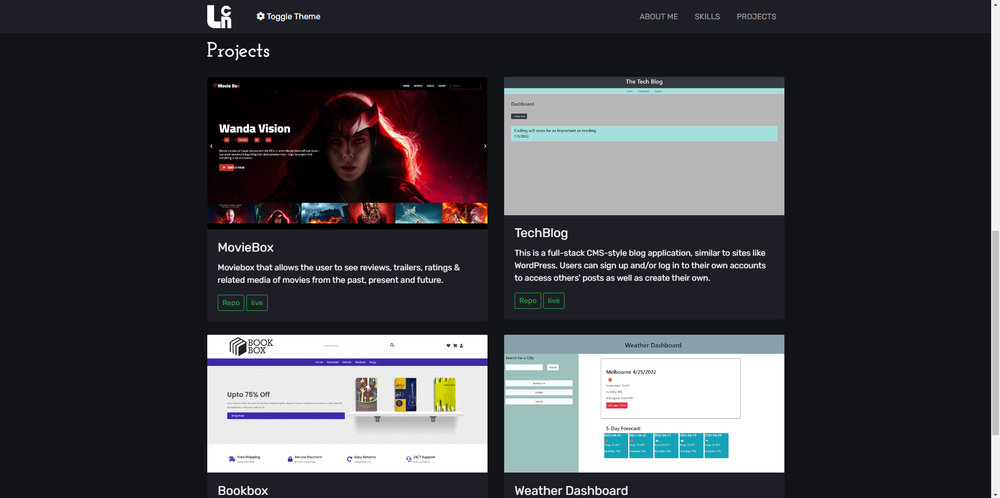
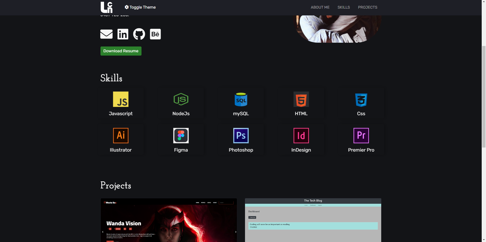
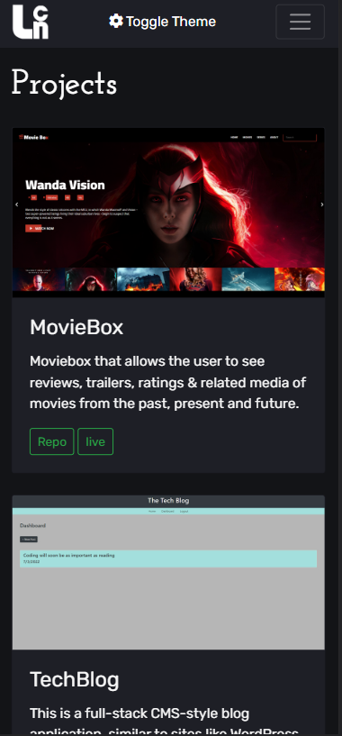
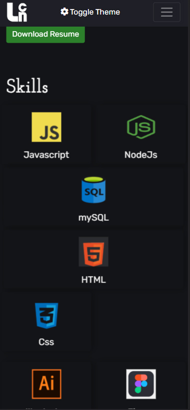
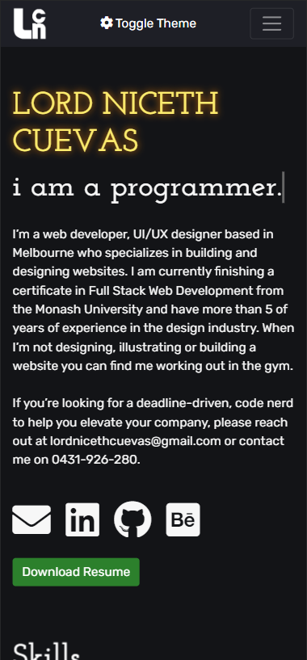

# Lord Niceth Cuevas

📌 [Link to Deployed Portfolio](https://lniceth.github.io/Porfolio-version-three/)

## 🔎 Overview
This portfolio is designed to highlight my skills and past projects. It also serves as documentation of my growth as a developer.

## 🧩 Tech Stack
- JavaScript
- Jquery
- Bootstrap
- CSS
- Html

## 📎 Usage
To visit the portfolio, follow [this link]().

## 📷 Screenshots

### 💻 Desktop View

#### Projects

#### Skills

#### About

### 📱 Mobile View

#### Projects

#### Skills

#### About

